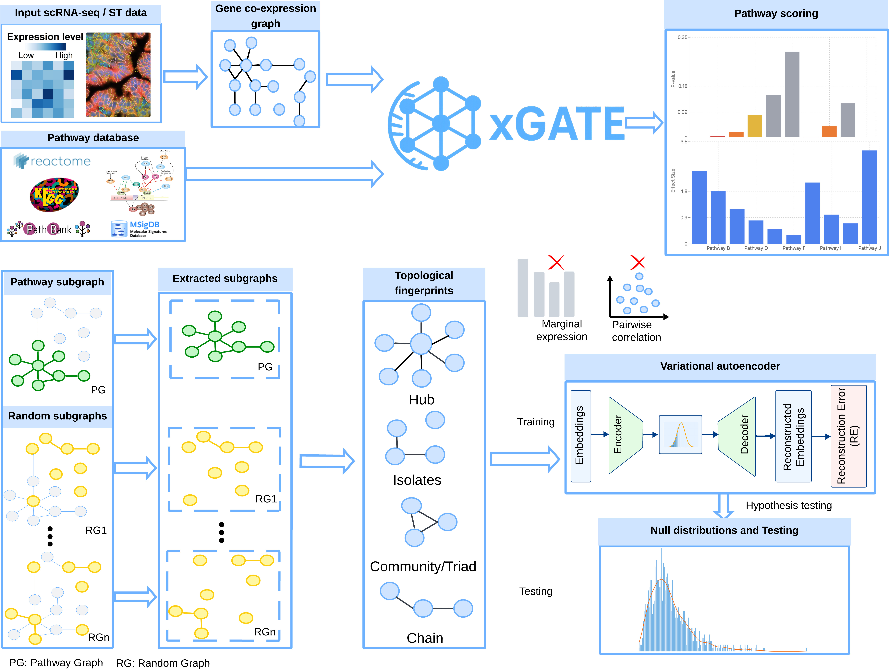

# xGATE: Topology-aware pathway scoring framework

**xGATE** is a topology-aware pathway scoring framework that reads pathway activity from the topological fingerprints of gene co-expression graphs in single-cell RNA-seq (scRNA-seq) and spatial transcriptomics data. By capturing topology structures in gene co-expression graphs, xGATE integrates graph theory, deep learning, and hypothesis testing to provide accurate and robust pathway activity estimates that are resilient to batch effects.

## Key Features

- **Biologically-Informed & Flexible**: Integrates established pathway databases (KEGG, Reactome, WikiPathways) while supporting custom gene sets tailored to your research questions
- **High Accuracy**: Leverages graph topology to capture biologically relevant co-expression patterns, delivering superior pathway activity identification across diverse cell types
- **Batch-Effect Resilient**: Relies on co-expression relationships rather than absolute expression levels, making it robust to batch effects common in multi-sample scRNA-seq studies
- **Topologically Aware**: Uses graph embeddings that capture meaningful network structures rather than treating pathways as unordered lists of genes

## How xGATE Works

**Input**: Count matrix + Gene set/pathway of interest → **Output**: Pathway p-value + Effect size

1. **Network Construction**: Builds a gene co-expression graph from your expression data
2. **Pathway Extraction**: Identifies pathway subgraph within the co-expression network
3. **Graph Embeddings**: Derives embeddings capturing topology features (centrality, walk properties, structural metrics)
4. **Null Distribution**: Uses a graph-based Variational Autoencoder (VAE) to establish null distribution
5. **Hypothesis Testing**: Performs statistical testing to assess pathway significance and compute effect sizes



## Installation

### Prerequisites
- Python ≥ 3.8
- A working count matrix from scRNA-seq or spatial transcriptomics (preferably normalized via scTransform or similar)

### Setup

```bash
# Clone the repository
git clone https://github.com/jichunxie/xGATE.git
cd xGATE

# Install dependencies
pip install -r requirements.txt
```

All required packages are specified in `requirements.txt`. The installation includes PyTorch (for VAE computations), networkx/igraph (for graph operations), and biological tools for pathway integration.

## Quick Start Guide

### Basic Workflow

```python
from utilities import *
import pandas as pd
import numpy as np

# 1. Load and preprocess your data
count_matrix = pd.read_csv("your_count_matrix.csv", index_col=0)

# Filter cells: keep genes expressed in at least 5% of cells
count_matrix = count_matrix.loc[(count_matrix > 0).sum(axis=1) > 0.05 * count_matrix.shape[1], :]

# Filter genes: keep genes with expression in at least 5% of cells  
count_matrix = count_matrix.loc[:, (count_matrix > 0).sum(axis=0) > 0.05 * count_matrix.shape[0]]

# Remove genes with zero or constant expression
row_means = np.mean(count_matrix, axis=1)
count_matrix = count_matrix[~((row_means == 0) | (row_means == 1))]

# 2. Create co-expression network
df = pd.DataFrame(count_matrix)
so = create_sifinet_object(df, rowfeature=True)  # Create data object
so = quantile_thres2(so)                          # Calculate thresholds
so = cal_coexp(so, X=so.data_thres['dt'], X_full=so.data_thres['dt'])  # Compute co-expression
so = create_network(so, alpha=0.05, manual=False, least_edge_prop=0.01)  # Build network
so = filter_lowexp(so, t1=10, t2=0.9, t3=0.9)   # Filter low-expression edges

# 3. Prepare gene ID mapping and network
adj_matrix = pd.DataFrame(np.where(
    np.abs(so.coexp - so.est_ms['mean']) > so.thres,
    np.abs(so.coexp),
    0
))
adj_matrix.index = df.index
adj_matrix.columns = df.index
adj_matrix = convert_gene_ids(adj_matrix, "ensembl")  # Convert to Entrez IDs

# 4. Create igraph network and load pathways
G = create_network_from_adj_matrix(adj_matrix)
categorized_pathways = get_categorized_pathways()  # Fetch KEGG pathways

# 5. Analyze pathways of interest
test_pathways = ["Cellular senescence", "Cell cycle", "Apoptosis"]
results = analyze_pathways(G, test_pathways, categorized_pathways, 
                          num_walks=200, max_walk_length=200)

# Results include p-values and effect sizes for each pathway
print(results)
```

### Expected Results Structure

The `analyze_pathways()` function returns a DataFrame with columns:
- **Pathway**: Name of the pathway
- **p_value**: Statistical significance of pathway activity
- **effect_size**: Magnitude of pathway activity
- **significant**: Boolean indicating significance at 0.05 threshold

### Using Custom Gene Sets

Instead of predefined KEGG pathways, you can analyze any custom gene set:

```python
# Define your custom pathway
custom_pathway = {
    "Your_Pathway_Name": ["GENE1", "GENE2", "GENE3", "GENE4"]
}

# Analyze single custom pathway
results = embedding_recon(G, categorized_pathways, 
                         custom_pathway["Your_Pathway_Name"],
                         num_walks=200, max_walk_length=200, 
                         null_dist_size=100)
```

## Available Utility Functions

### Data Processing (`data_processing.py`)
- `create_sifinet_object()`: Initialize data object from count matrix
- `quantile_thres2()`: Calculate expression thresholds
- `cal_coexp()`: Compute co-expression matrix
- `cal_coexp_df()`: Co-expression for DataFrame input
- `cal_coexp_sp()`: Co-expression for sparse matrices
- `filter_lowexp()`: Filter low-expression edges
- `feature_coexp()`: Feature-level co-expression analysis

### Pathway Analysis (`pathway_analysis.py`)
- `create_network()`: Build co-expression network
- `create_network_from_adj_matrix()`: Create network from adjacency matrix
- `convert_gene_ids()`: Convert between gene ID formats (Ensembl ↔ Entrez)
- `get_entrez_mapping()`: Retrieve gene ID mappings
- `get_categorized_pathways()`: Fetch pathway information from KEGG
- `get_genes_in_pathway()`: Extract genes for specific pathway
- `analyze_pathways()`: **Main function** for pathway significance testing
- `gene_coexpression_network()`: Build network with custom parameters

### Graph Embeddings (`embeddings.py`)
- `generate_embedding()`: Create graph-based embeddings
- `embedding_recon()`: Embedding reconstruction for pathway analysis
- `longest_random_walk()`: Random walk feature extraction
- `subgraph_centrality()`: Centrality-based metrics

### Competitive Analysis (`competitive_analysis.py`)
- `competitive_pathway_analysis()`: Compare pathway significance with competing pathways
- `embedding_recon_competitive()`: Competitive embedding reconstruction with visualization

### VAE Model (`vae_model.py`)
- `VariationalAutoencoder`: Neural network for null distribution modeling
- `vae_loss_function()`: Training loss calculation
- `calculate_reconstruction_error()`: Assess embedding reconstruction quality

## Input Data Requirements

### Count Matrix Format
- **Rows**: Genes (or use `rowfeature=True` to transpose)
- **Columns**: Cells/samples
- **Values**: Raw or normalized counts
- **Index/Columns**: Gene identifiers (Ensembl or Gene Symbol recommended)

**Note**: Input data should be pre-normalized using appropriate methods (scTransform, log-CPM, etc.). xGATE works with the processed matrix without additional normalization.

### Gene ID Support
xGATE supports multiple gene ID formats and can convert between:
- Ensembl IDs
- Gene Symbols
- Entrez Gene IDs
- HGNC symbols

Use `convert_gene_ids()` to map identifiers before network construction.

## Parameter Guide

### Network Construction Parameters
- `alpha`: Significance level for co-expression threshold (default: 0.05)
- `least_edge_prop`: Minimum edge weight proportion (default: 0.01)
- `manual`: Whether to manually specify threshold (default: False)

### Embedding Parameters
- `num_walks`: Number of random walks per node (default: 200)
- `max_walk_length`: Maximum walk length (default: 200)

### VAE Parameters
- `null_dist_size`: Number of random pathways for null distribution (default: 100)

## Tutorial & Examples

For a complete worked example with sample data, see [xGATE_Tutorial.ipynb](xGATE_Tutorial.ipynb) in this repository.

## Troubleshooting

### Common Issues

**Memory Error with Large Graphs**
- Reduce `null_dist_size` parameter in pathway analysis
- Filter genes more stringentially before network construction

**No Pathways Found**
- Verify gene IDs match between count matrix and pathway database
- Check that genes in your pathways are present in the co-expression network
- Use `get_genes_in_pathway()` to debug specific pathway membership

**Gene ID Conversion Fails**
- Ensure input IDs are in a supported format (Ensembl, Symbol, Entrez)
- Check for typos or outdated gene names
- Use MyGene.info API directly to troubleshoot mappings

## Performance Considerations

- **Network size**: Works efficiently with 5,000-25,000 genes
- **Cell count**: Scales well up to 100,000+ cells
- **Runtime**: Typically 5-30 minutes depending on data size and parameters
- **Memory**: ~8-16 GB RAM recommended for large datasets

## Citation

If you use xGATE in your research, please cite:

```
[Citation information to be added upon publication]
```

## License

This project is licensed under CC BY-NC-ND 4.0 - see [LICENSE.md](LICENSE.md) for details.

## Contact & Support

For questions, issues, or feature requests, please open an issue on GitHub or contact the maintainers.

## References

- KEGG Pathway Database: https://www.kegg.jp/
- Reactome: https://reactome.org/
- WikiPathways: https://www.wikipathways.org/
- PyTorch: https://pytorch.org/
- igraph: https://igraph.org/
